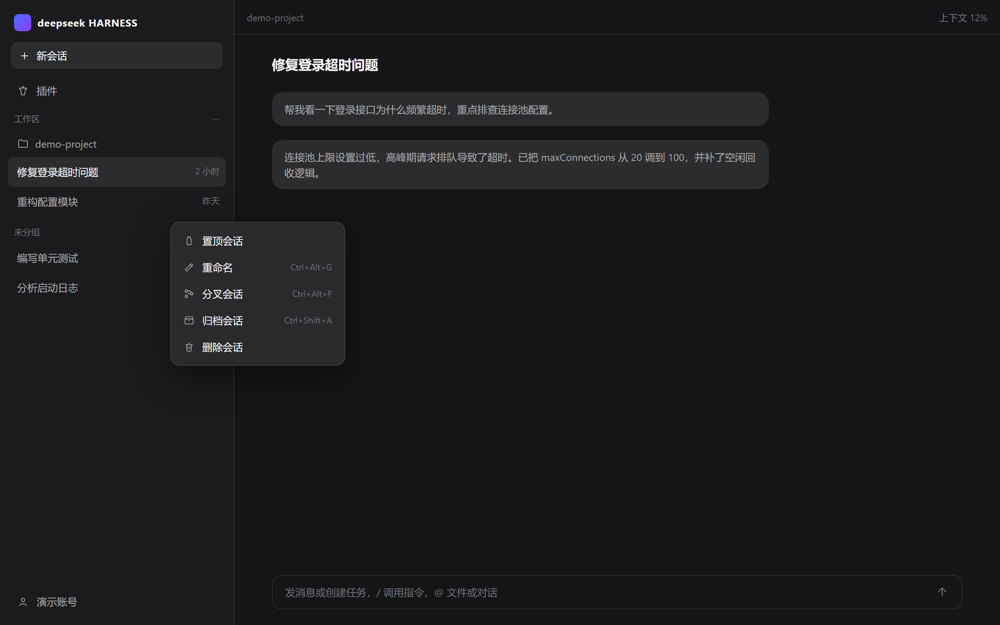
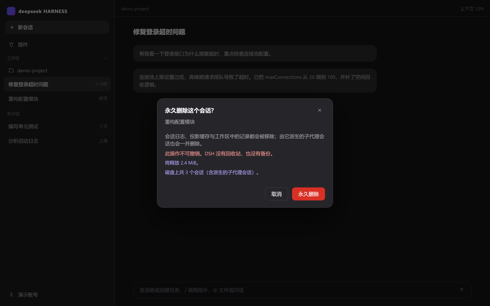
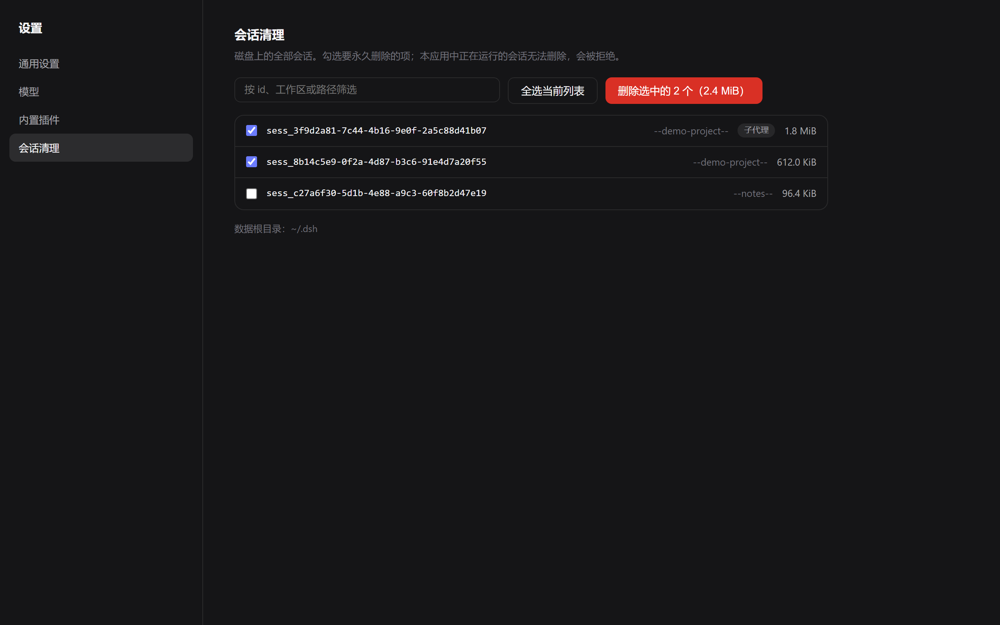

# dsh-cleaner

给 **DeepSeek Harness（DSH）** 桌面版 / Web 版补上**删除会话**能力的客户端插件。

DSH 本身没有任何删除会话的途径：会话只能归档，官方文档明确写着「删除工作区注册记录不会删除会话」。时间久了，`~/.dsh/sessions/` 里的历史会话日志只增不减。本插件把这个缺口补上，并且把删除做彻底——会话日志、投影缓存、工作区注册表引用、派生搜索索引、连同全部子代理会话，一次清干净。







*以上为示意图（演示数据）。*

## 功能

- **三个入口**：侧边栏会话「⋯」菜单 → 删除会话（带确认弹窗）；设置 → 插件 → 会话清理（全盘列表 + 筛选 + 批量删除）；模型 Tool `session_delete`（默认 dry-run）。
- **级联清理**：删除主会话时，由它派生的全部子代理会话一并删除（含多级）。
- **勾选即删除闭包**：批量面板勾选主会话会自动带上其子代理，选中数量与释放空间和实际删除完全一致。
- **安全设计**：三重路径校验、运行中的会话先停止再删、当前打开的会话拒绝删除、不可撤销操作前明确确认。
- **界面与宿主一致**：菜单行、确认弹窗、设置面板全部使用 DSH 官方 primitives 组件渲染。

## 安装

DSH 的 profile 使用 pnpm 的 `file:` 依赖声明：

```jsonc
// ~/.dsh/profiles/<profile>/package.json
{
  "dependencies": { "dsh-plugin-session-cleaner": "file:<本仓库的克隆路径>\\plugin" },
  "dsh": { "profile": { "bundles": [ /* ... */, "dsh-plugin-session-cleaner" ] } }
}
```

随后在 profile 目录执行 `pnpm install`，**完全退出并重启 DSH**（Host 会把插件元数据缓存在内存里直到重启）。

## 它删什么

| 位置 | 内容 |
|---|---|
| `~/.dsh/sessions/<工作区slug>/<sessionId>/` | 会话日志（唯一真相） |
| `~/.dsh/storages/session_projcache/sessions/` | 投影缓存 |
| `~/.dsh/storages/workspace.json` | 注册表中的引用 |
| `~/.dsh/storages/*.db` | 派生搜索索引（无法对齐时移除，自动重建） |

不碰凭据、设置、skills、profiles 与工作区注册本身。**没有回收站，删除不可撤销。**

## 开发

```sh
node build/client.mjs                          # 构建 lib/
node --test tests/cleaner.test.mjs \
           tests/plugin.test.mjs \
           tests/client.test.mjs               # 35 个测试
```

零运行时依赖，离线可构建。插件分两半：Host 侧（服务、Remote 契约、模型 Tool）与 Web 客户端侧（菜单项、确认弹窗、设置面板），共用同一份 strict 编解码契约。

完整文档——包括 DSH 客户端插件开发的**踩坑记录**（Cordis 服务注入、Remote namespace 组合键、官方 primitives 组件、slot props 约定等）——见 [plugin/README.md](plugin/README.md)。

## License

MIT
